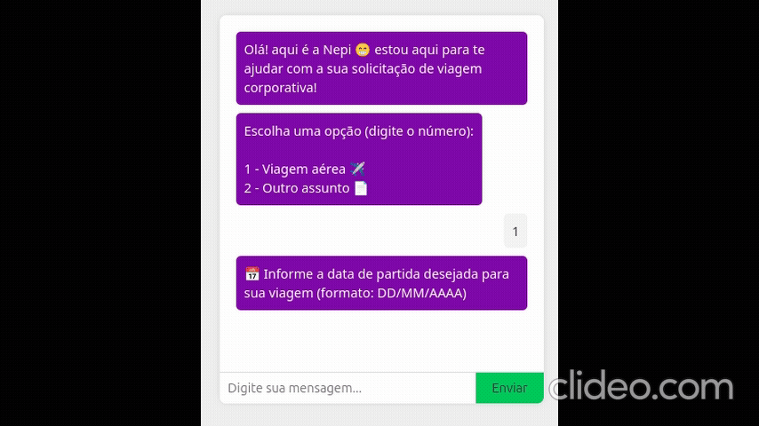

# 🤖 Nepi Chatbot – Agendamento de Viagens Corporativas

Este projeto é um **chatbot web interativo**, construído com **Node.js (backend)** e **JavaScript puro (frontend)**. Ele simula um atendimento de **solicitação de viagens corporativas**, utilizando uma **máquina de estados** e integração com API externa para previsão do tempo.

---

## 🚀 Tecnologias Utilizadas

- **Frontend:** HTML, CSS, JavaScript (Vanilla)
- **Backend:** Node.js, Express, Fuse.js, dotenv
- **APIs Externas:** [Open-Meteo](https://open-meteo.com/)
- **Docker:** Dockerfile + Docker Compose
- **Hot Reload:** Nodemon no backend

---

## 📦 Estrutura do Projeto

```
📁 backend
│   ├── server.js
│   ├── .env
│   ├── validators/
│   ├── infra/
│   └── ...
📁 frontend
│   ├── index.html
│   ├── style.css
│   └── main.js
Dockerfile.backend
Dockerfile.frontend
docker-compose.yml
README.md
```

---

## 🧪 Pré-requisitos

- Docker
- Docker Compose

---

## ▶️ Como Executar Localmente

1. Clone este repositório:

```bash
git clone https://github.com/seu-usuario/seu-repo.git
cd seu-repo
```

2. Crie o arquivo `.env` na pasta `backend/` com o seguinte conteúdo:

```env
PORT=3000
API_KEY=sua_chave_da_open_meteo
```

> 🔑 Você pode usar dados genéricos do Open-Meteo (não exige chave) ou adaptar para OpenWeather.

3. Suba a aplicação com Docker:

```bash
docker-compose up -d
```

4. Acesse:

- 🧠 Frontend: [http://localhost:8089](http://localhost:8089)
- ⚙️ Backend: [http://localhost:3000](http://localhost:3000)

---

## 📚 Funcionalidades

- Fluxo controlado por estados:
  - Escolha de iniciar ou sair
  - Informar data da viagem
  - Cidade de origem e destino
  - Confirmação final
- Validação para impedir cidades iguais
- Histórico completo da conversa disponível no backend
- Previsão do tempo da cidade de origem (via latitude/longitude)
- Comunicação assíncrona entre frontend e backend via `fetch()`

---

## ⚠️ Observações

- O projeto é um **protótipo leve**, sem banco de dados.
- O histórico é mantido no frontend e enviado ao backend a cada interação.
- O backend está preparado para ser expandido com novas regras e fluxos.

---

## 🧾 Exemplo `.docker-compose.yml`

```yaml
version: "3.8"
services:
  backend:
    build:
      context: .
      dockerfile: Dockerfile.backend
    ports:
      - "3000:3000"
    volumes:
      - ./backend:/app
      - /app/node_modules
    env_file:
      - ./backend/.env

  frontend:
    build:
      context: .
      dockerfile: Dockerfile.frontend
    ports:
      - "8089:80"
    depends_on:
      - backend
```

---

## 🗂️ .gitignore (sugestão)

```
# .gitignore
node_modules
.env
npm-debug.log
```

---

## 👨‍💻 Autor

Feito por **Luiz Jolo** como estudo de arquitetura de chatbot, Docker e integração com APIs.

---

## 🧠 Inspiração

Este projeto foi inspirado na construção de fluxos inteligentes para bots de atendimento corporativo e na simplicidade de aplicações fullstack leves com Docker.

Demonstração do chatbot utilizando entradas erradas na cidade onde a técnica de NLP FUZZY MATCH é inserida. Ex: usuário digita "sao paull" o sistema reconhece "São Paulo"


